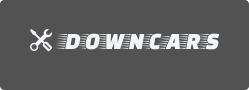
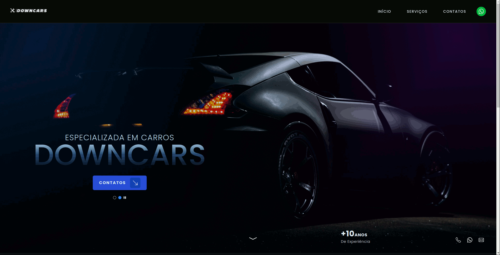

<h1 align="center">
    
    <br>
    Oficina Mecânica DownCars
</h1>

<h3 align="center">Projeto feito para oficina mecânica downcars com o objetivo de divulgar seu trabalho.</h3>

<div align="center" >
  
</div>

<p align="center"><a href="https://downcars-next.netlify.app/">Acessar Projeto</a></p>

# Tecnologias

<p>Foram usadas as seguintes tecnologias:</p>

- [NextJS](https://nextjs.org/)
- [Typescript](https://www.typescriptlang.org/)
- [TailwindCSS](https://tailwindcss.com/)
- [HeadlessUI](https://headlessui.dev/)

<p>São tecnologias que gosto e que estava precisando colocar em prática! E claro, se o projeto crescer irá facilitar muito.</p>

# Objetivos

Decidi fazer esse projeto para a oficina do meu pai, pois queria fazer uma aplicação útil que resolvesse problemas, aprender novas tecnologias e sentir um gostinho de fazer um trabalho real e bem planejado.

# Aprendizados

- Consegui usufruir muito do TailwindCSS, uma tecnologia que queria muito usar;
- Planejar meus projetos, pensar em Design, Prototipagem, Tecnologias e Estrutura de arquivos antes de fazer o código;
- Sempre pensar em quem pode usar sua aplicação, então deixar acessível para todos!;
- Animações, para dar mais vida para a aplicação.

# Rodando o projeto

```bash
1. Clone o repositório:
$ git clone https://github.com/gabriellima2/downcars.git

2. Acesse a pasta e instale as dependências via terminal:
$ yarn / npm install

3. Inicie a aplicação em modo de desenvolvimento:
$ yarn dev / npm run dev

4. O servidor será aberto em http://localhost:3000
```

<p align="center">Projeto feito com 💙 por <a href="https://www.linkedin.com/in/gabriel-lima-860612236">Gabriel Lima</a></p>
